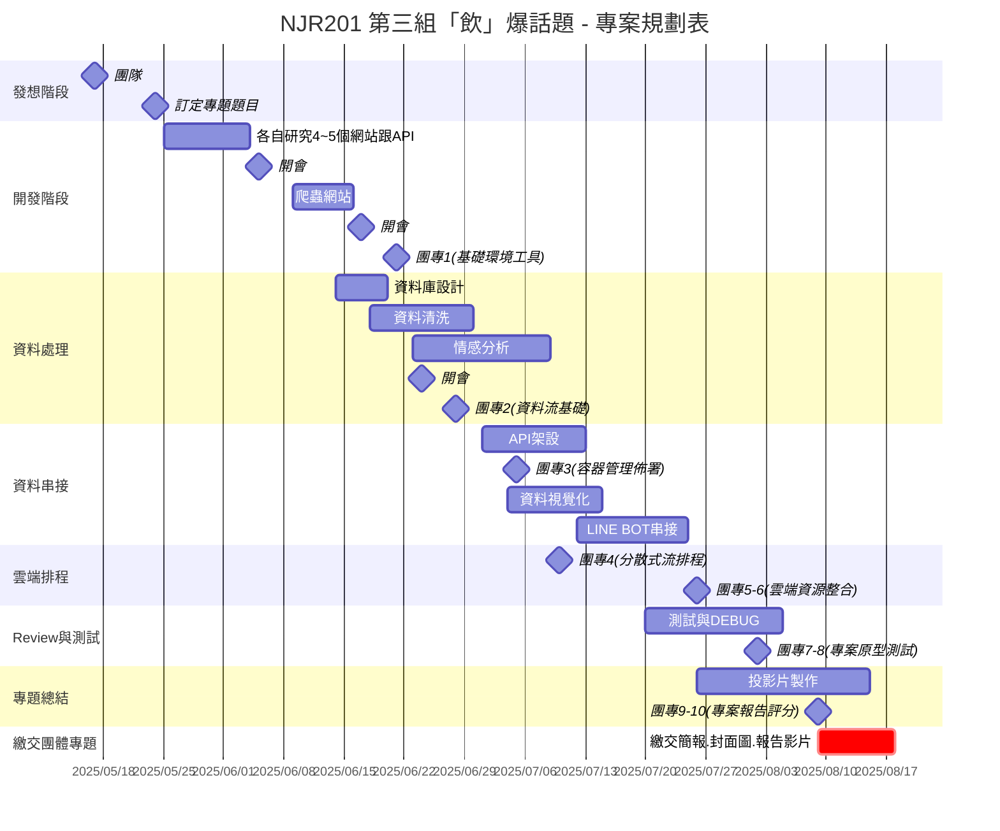

# .github

```mermaid height=700,auto

gantt
    title NJR201 第三組「飲」爆話題 - 專案規劃表
    dateFormat  YYYY-MM-DD
    axisFormat %Y/%m/%d
    tickInterval 1week %% 預設好像就是一周，先寫著
    weekday monday %% 設定星期一
    %% 狀態_done完成_active進行中_crit關鍵路徑_milestone里程碑
    %% 緊湊_displayMode_compact


    section 發想階段
    團隊                     :milestone, 2025-05-17, 2025-05-17
    訂定專題題目             :milestone, 2025-05-24, 2025-05-24

    section 開發階段
    各自研究4~5個網站跟API   :           2025-05-25, 2025-06-04
    開會                     :milestone, 2025-06-05, 0d
    爬蟲網站                 :           2025-06-09, 2025-06-16
    開會                     :milestone, 2025-06-17, 0d
    團專1(基礎環境工具)      :milestone, 2025-06-21, 0d

    section 資料處理
    資料庫設計               :           2025-06-14, 2025-06-20
    資料清洗                 :           2025-06-18, 2025-06-30
    情感分析                 :           2025-06-23, 2025-07-09
    開會                     :milestone, 2025-06-24, 0d
    團專2(資料流基礎)        :milestone, 2025-06-28, 0d
    
    section 資料串接
    API架設                  :           2025-07-01, 2025-07-13
    團專3(容器管理佈署)      :milestone, 2025-07-05, 0d
    資料視覺化               :           2025-07-04, 2025-07-15
    LINE BOT串接             :           2025-07-12, 2025-07-25

    section 雲端排程
    團專4(分散式流排程)      :milestone, 2025-07-10, 0d
    團專5-6(雲端資源整合)    :milestone, 2025-07-26, 0d

    section Review與測試
    測試與DEBUG              :           2025-07-20, 2025-08-05
    團專7-8(專案原型測試)    :milestone, 2025-08-02, 0d

    section 專題總結
    投影片製作               :           2025-07-26, 2025-08-15
    團專9-10(專案報告評分)   :milestone, 2025-08-09, 0d

    section 繳交團體專題
    繳交簡報.封面圖.報告影片 :     crit, 2025-08-09, 2025-08-18
```
