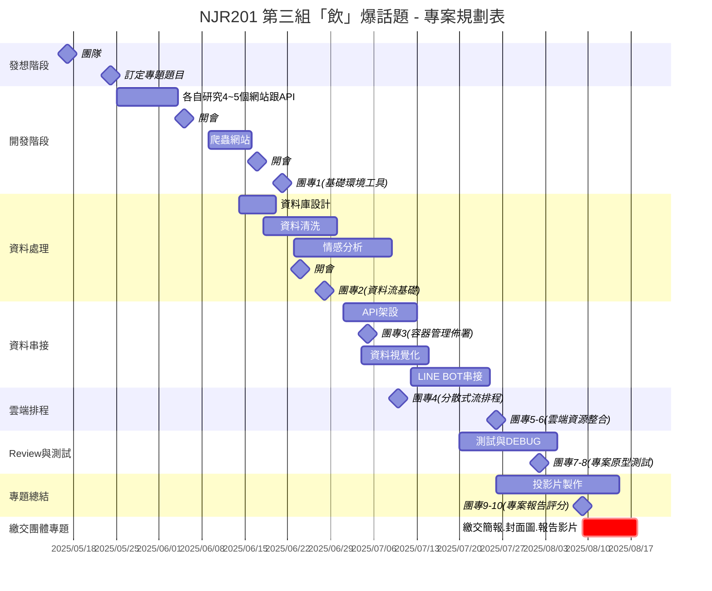

<!--

**Here are some ideas to get you started:**

🙋‍♀️ A short introduction - what is your organization all about?
🌈 Contribution guidelines - how can the community get involved?
👩‍💻 Useful resources - where can the community find your docs? Is there anything else the community should know?
🍿 Fun facts - what does your team eat for breakfast?
🧙 Remember, you can do mighty things with the power of [Markdown](https://docs.github.com/github/writing-on-github/getting-started-with-writing-and-formatting-on-github/basic-writing-and-formatting-syntax)
-->
## 👋 Tibame NJR201 第三組「飲」爆話題

### 🥤 前言
手搖飲市場蓬勃發展，海內外人士也紛紛來嚐鮮，這成為我們製作專題的動機，希望透過社群平台的輿情分析，掌握消費者偏好、話題趨勢。

---

### 🥤 分析主題：手搖飲熱度聲量
#### 手搖飲熱度聲量
- 飲料品牌
- 飲料品項
- 情感分析

---
### 🥤 研究目的
- 探討手搖飲在各大社群平台（DPTT、YouTube）上的聲量與熱度變化
- 分析主要討論話題、品牌好感度、消費者情緒傾向
- 尋找品牌聲量高峰與事件關聯（行銷、爭議等）

---
### 🥤 爬蟲資料來源平台
- PTT：飲料版有許多消費者的意見推噓
- YouTube：美食等影片分析

---
### 🥤 資料庫選擇
- MySQL

---
### 🥤 組員
- 28 - 陳伯勳
- 35 - 陳瑋
- 16 - 李泳葳
- 32 - 簡瑋靜
- 01 - 柯景泰 (組長)
- 02 - 徐皓偉

「要不要來一杯手搖飲？」

「GO！」

---
## 🗺️ 專案規劃表

